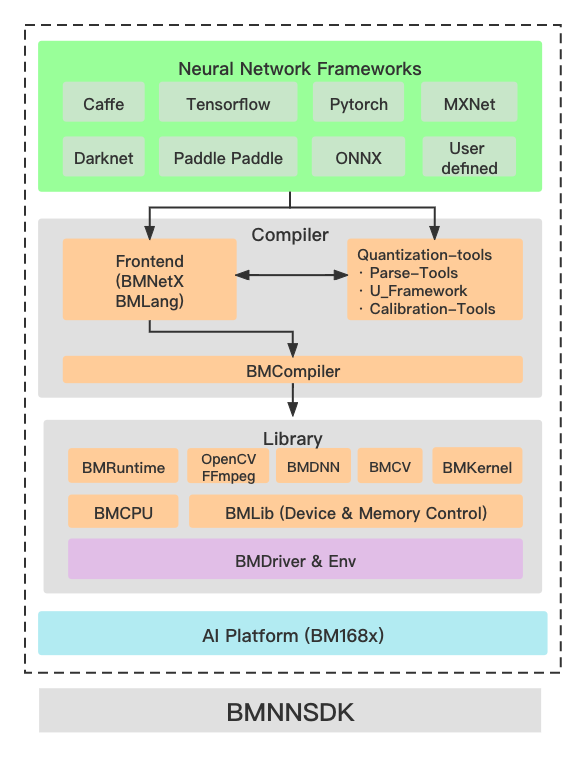

# 1.1 BMNNSDK2 简介

BMNNSDK2是算能科技基于其自主研发的 AI 芯片所定制的深度学习SDK，涵盖了神经网络推理阶段所需的模型优化、高效运行时支持等能力，为深度学习应用开发和部署提供易用、高效的全栈式解决方案。

**1.1.1 BMNNSDK2 由 Compiler，Library和 Examples 部分组成：**

* Compiler 负责对第三方深度学习框架下训练得到的神经网络模型进行离线编译和优化，生成最终运行时需要的 BModel。目前支持Caffe、Darknet、MXNet、ONNX、PyTorch、PaddlePaddle、TensorFlow等。
* Library提供了BM-OpenCV、BM-FFmpeg、BMCV、BMRuntime、BMLib等库，用来驱动VPP、VPU、JPU、TPU等硬件，完成视频图像编解码、图像处理、张量运算、模型推理等操作，供用户进行深度学习应用开发。
* Examples提供了SoC和x86环境下的多个例子，供用户在深度学习应用开发过程中参考。



**1.1.2 当前BMNNSDK2提供了两个文件，具体文件如下表所示：**

| 文件名                            | 备注                                             |
| ------------------------------ | ---------------------------------------------- |
| bmnnsdk2-bm1684\_vx.x.x.tar.gz | bmnnsdk x86平台开发包，支持cmodel，pcie，soc和arm\_pcie模式 |
| bmnnsdk2-bm1684-ubuntu.docker  | bmnnsdk编译开发用的docker                            |

**1.1.3 解压后的SDK文件结构如下：**

后续使用${BMNNSDK}来指代SDK解压后的根目录：在宿主机上时，它是您解压文件时指定的存放文件的路径；在docker容器中时，若您没有修改SDK下的创建容器脚本，该路径默认为/workspace。

```
BMNNSDK2

├── bin                    # 各个平台的相关工具
│   ├── arm                # soc平台，对应SE5/SM5设备
│   ├── arm_pcie           # ARM指令集CPU的服务器主机
│   ├── fib.bin            # 
│   ├── firmware           # BM1684中MCU的固件
│   ├── loongarch64        # loongarch指令集CPU的服务器主机
│   ├── mips64             # MIPS指令集CPU的服务器主机
│   ├── ramboot_rootfs.itb # 
│   ├── spi_flash.bin      #
│   ├── sw64               # SW64指令集CPU的服务器主机
│   └── x86                # intel x86主机
├── bmlang                 # 面向Sophon TPU的高级编程接口
├── bmnet                  # Compiler工具的可执行文件或pip安装whl包或文件
│   ├── bmcompiler         # compiler
│   ├── bmlog              # 日志模块
│   ├── bmnetc             # Caffe Compiler
│   ├── bmnetd             # Darknet Compiler
│   ├── bmnetm             # MXNet Compiler
│   ├── bmneto             # ONNX Compiler
│   ├── bmnetp             # Pytorch Compiler
│   ├── bmnett             # TensorFlow Compiler
│   ├── bmnetu             # int8 Umodel compiler
│   ├── bmpaddle           # PaddlePaddle Compiler 
│   ├── bmprofile          # 性能分析工具
│   ├── bmtflite           # TFLite Compiler
│   ├── bmusercpu          # 使用1684上的A53 arm cpu相关的源文件
│   ├── calibration        # 量化工具ufw安装包
│   └── debugtools         # 调试工具源码
├── documents              # 用户手册
├── driver                 # PCIE卡设备驱动源码
├── examples               # 示例代码
├── include                # 运行库头文件，供二次开发使用，每个模块一个文件夹
├── lib                    # 运行库及第三方库，供运行时和二次开发使用
├── release_version.txt    # SDK发布版本号
├── res                    # 测试图片
├── scripts                # 常用脚本：驱动安装、软件库安装、环境变量设置
├── run_docker_bmnnsdk.sh  # Docker启动脚本
└── test                   # 测试脚本，用户无需关注
```
