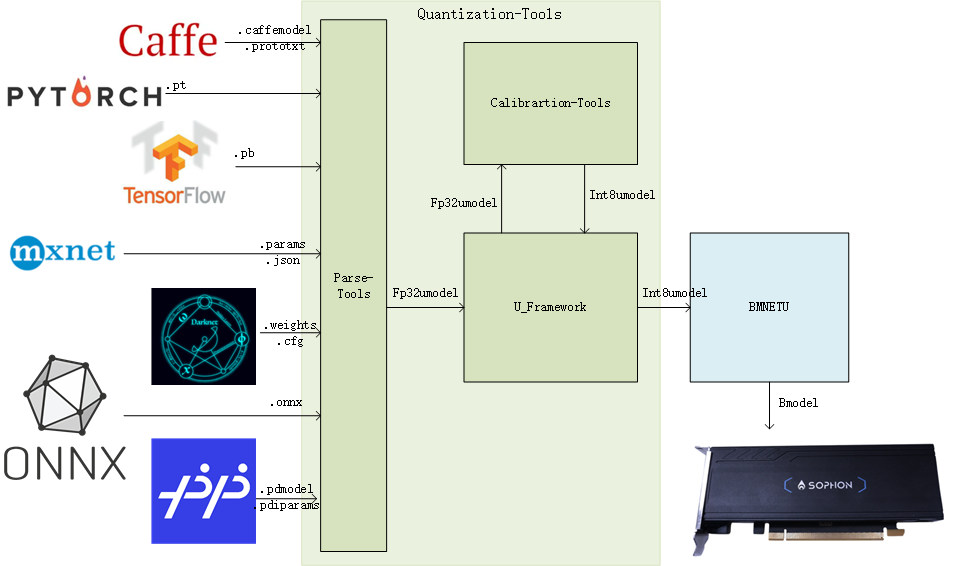
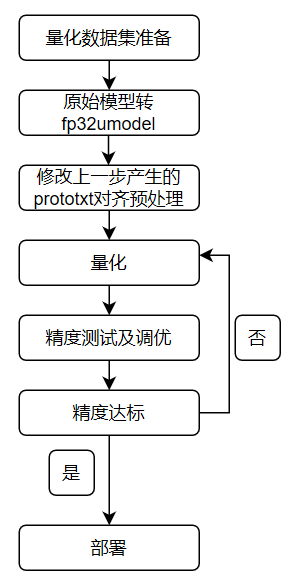

# 3.3 INT8 模型生成

​BM168X支持INT8量化模型的部署。在通用流程中，需要先借助于算能提供的量化工具对fp32模型进行量化。 ​Qantization-Tools是算能科技自主开发的网络模型量化工具，它解析各种已训练好的32bit浮点网络模型，生成8bit的定点网络模型。该8bit定点网络模型，可用于算能科技SOPHON系列AI运算平台。在SOPHON运算平台上，网络各层输入、输出、系数都用8bit来表示，从而在保证网络精度的基础上，大幅减少功耗，内存，传输延迟，大幅提高运算速度。 ​

Quantization-Tools由三部分组成：Parse-Tools、Calibration-Tools以及U-FrameWork，如下图所示:

*   Parse-Tools：

    解析各深度学习框架下已训练好的网络模型，生成统一格式的网络模型文件—umodel， 支持的深度学习框架包括： Caffe、TensorFlow、MxNet、PyTorch、Darknet、ONNX以及PaddlePaddle。
*   Calibration-Tools：

    分析float32格式的umodel文件，默认基于熵损失最小算法（可选MAX等其他算法），将网络系数定点化成8bit，最后 将网络模型保存成int8格式的umodel文件。
*   U-FrameWork：

    自定义的深度学习推理框架，集合了各开源深度学习框架的运算功能，提供的功能包括：

    1. 作为基础运算平台，为定点化提供基础运算。
    2. 作为验证平台，可以验证fp32，int8格式的网络模型的精度。
    3. 作为接口，通过bmnetu，可以将int8umodel编译成能在SOPHON运算平台上运行的bmodel。

使用Quantization-Tools量化网络流程如下图：

**生成int8量化模型，通常需要以下步骤：**

1. 准备lmdb数据集；
2. 生成fp32 Umodel；
3. 生成int8 Umodel；
4. int8 Umodel精度测试（可选）；
5. 生成int8 Bmodel。
