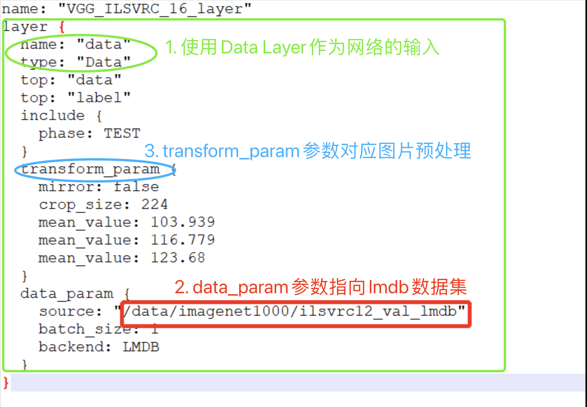

# 3.3.3 生成INT8 Umodel

此流程从fp32 Umodel转换为int8 Umodel，即为量化过程。 网络量化过程包含下面两个步骤：

1. **优化网络：**对输入浮点网络图进行优化&#x20;
2. **量化网络：**对浮点网络进行量化得到 int8 网络图及系数文件&#x20;

量化需要用到[3.3.1 准备lmdb数据集](lmdb.md)中产生的 lmdb 数据集，而正确使用数据集尤为重要，所以先说明如何使用数据集。

对于 post-training 量化方法，通过将训练后的模型进行一定次数的推理，来统计每层的输入输出数据范围，从而确定量化参数。为了使统计尽可能准确，**推理时候必须保证输入的数据为实际训练/验证时 候的有效数据，前处理也保证和训练时候的一样**。&#x20;

因此 Uframework 中提供了简单的前处理接口可以对生成的 lmdb 数据进行前处理以对齐训练过程 的预处理。通过修改生成 fp32 umodel 时候生成的 \*\_test\_fp32.prototxt 文件也可配置前处理算法，生成的lmdb数据在输入网络前会按照此处的配置进行计算后再进行真正的网络推理，完整的前处理可以视为制作lmdb时进行的前处理和prototxt中定义的前处理算法的组合。

### 3.3.3.1 数据预处理

一般可以做以下 3 方面的修改：

* 使用Data layer 作为网络的输入
* 使 Data layer 的参数 data\_param 指向生成的 lmdb 数据集的位置
* 修改 Data layer 的 transform\_param 参数以对应网络对图片的预处理

data\_layer的典型结构如下例所示：

```protobuf
layer {
   name: "data"
   type: "Data"
   top: "data"
   top: "label"
   include {
      phase: TEST
   }
   transform_param {
      transform_op {
         op: RESIZE
         resize_h: 331
         resize_w: 331
      }
      transform_op {
         op: STAND
         mean_value: 128
         mean_value: 128
         mean_value: 128
         scale: 0.0078125
      }
   }
   data_param {
      source: "/my_lmdb"
      batch_size: 0
      backend: LMDB
   }
}
```

例如：



在量化网络前，需要修改网络的 \*\_test\_fp32.prototxt 文件，在 datalayer（或者 AnnotatedData layer）添加其数据预处理的参数，以保证送给网络的数据与网络在原始框架中训练时的预处理一致。

Calibration-tools 量化工具支持两种数据预处理表示方式：

.png>)

1. **Caffe自带的TransformationParameter 参数表示方法：**Caffe自带的表示方法各个参数的执行顺序相对固定（如上图右半部所示），但很难完善表达Tensorflow、Pytorch 等基于Python的框架里面灵活多变的预处理 方式，仅适用于 Caffe 模型的默认数据预处理方式。使用此方式，前处理操作和参数直接以 transform\_param 的参数的形式定义。
2. **算能科技自定义的TransformOp 数组表示方法：**我们定义了transform\_op结构，将需要进行的预处理分解为不同的 transform\_op，按照顺序列在transform\_param中，程序会按照顺序分别执行各项计算。&#x20;


**注意：**

* 在修改 prototxt 文件添加数据预处理时，使用transform\__param和transform_\_op定义预处理只能二选一，请优先使用_transform_\_op。&#x20;
* 关于transform\__param和transform_\_op的更详细内容请查看《量化工具用户开发手册》中的[TransformOp定义](https://doc.sophgo.com/docs/docs\_latest\_release/calibration-tools/html/module/chapter4.html#transformop)。
* 当前版本开始对lmdb有升级，制作lmdb只有python形式的接口提供，示例程序create\_lmdb提供了例程可在其基础上修改。推荐在python代码中将预处理一并包含，生成已经预处理过的数据供量化使用，这样就不必在prototxt中定义前处理。 制作lmdb时候需要生成与网络输入shape一致的数据，当此lmdb用作转换fp32umodel命令的-D参数的输入时，上述prototxt的data layer的batch\_size参数会自动设置为0，如果转换fp32umodel过程中没有指定-D参数，则<mark style="color:green;">手工修改prototxt指定数据源时需要注意将batch\_size设置为0</mark>。 <mark style="color:red;">以前版本二进制convert\_imageset工具生成的lmdb配合以前的prototxt是兼容的。</mark>


### **3.3.3.2 量化网络**

使用`calibration_use_pb` 可以完成网络的量化，具体请参考《量化工具用户开发手册》[量化网络](https://doc.sophgo.com/docs/3.0.0/docs\_latest\_release/calibration-tools/html/module/chapter5.html#quantize-nets)。

### **3.3.3.3 优化网络**

使用`calibration_use_pb` 可以完成网络的优化，默认配置下对输入浮点网络进行优化，包括：batchnorm 与 scale 合并，前处理融合到网络，删除推理过程中不必要的算子等功能。具体请参考《量化工具用户开发手册》[优化网络](https://doc.sophgo.com/docs/3.0.0/docs\_latest\_release/calibration-tools/html/module/chapter5.html#optimize-nets)。

### **3.3.3.4 级联网络量化**


### **级联网络量化**

级联网络的量化需要对每个网络分别进行量化，对每个网络分别准备 LMDB 和量化调优。

