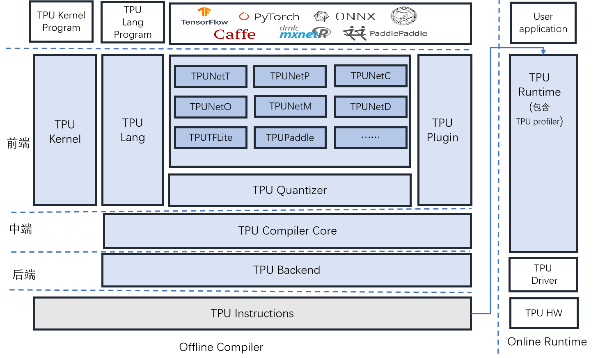

# 1.1 SDK 简介

SophonSDK是算能科技基于其自主研发的 AI 芯片所定制的深度学习SDK，涵盖了神经网络推理阶段所需的模型优化、高效运行时支持等能力，为深度学习应用开发和部署提供易用、高效的全栈式解决方案。

从3.0.0开始BMNNSDK更名为：SophonSDK。3.y.z版本将兼容第三代BM1684芯片，并支持第四代BM1684X芯片。

**1.1.1 SophonSDK 由 Compiler和Library组成：**

* Compiler 负责对第三方深度学习框架下训练得到的神经网络模型进行离线编译和优化，生成最终运行时需要的 BModel。目前支持Caffe、Darknet、MXNet、ONNX、PyTorch、PaddlePaddle、TensorFlow等。
* Library提供了BM-OpenCV、BM-FFmpeg、BMCV、TPURuntime、BMLib等库，用来驱动VPP、VPU、JPU、TPU等硬件，完成视频图像编解码、图像处理、张量运算、模型推理等操作，供用户进行深度学习应用开发。


Examples提供了SoC和x86环境下的多个例子，供用户在深度学习应用开发过程中参考。从3.0.0开始，这部分例程代码从SDK中移至github仓库开源：[https://github.com/sophon-ai-algo/examples](https://github.com/sophon-ai-algo/examples)





**1.1.2 SophonSDK提供了两个文件，具体文件如下表所示：**

| 文件名                                                   | 备注                                               |
| ----------------------------------------------------- | ------------------------------------------------ |
| sophonsdk\_vx.x.x.tar.gz                              | sophonsdk x86平台开发包，支持cmodel，pcie，soc和arm\_pcie模式 |
| x86\_sophonsdk3\_ubuntu18.04\_py37\_dev\_22.06.docker | sophonsdk v3 编译开发用的docker                        |

**1.1.3 解压后的SDK文件结构如下：**

后续使用${BMNNSDK}来指代SDK解压后的根目录：在宿主机上时，它是您解压文件时指定的存放文件的路径；在docker容器中时，若您没有修改SDK下的创建容器脚本，该路径默认为/workspace。

```
SophonSDK3

├── bin                    # 各个平台的相关工具
│   ├── arm                # soc平台，对应SE5/SM5设备
│   ├── arm_pcie           # ARM指令集CPU的服务器主机
│   ├── fib.bin            # 
│   ├── firmware           # BM1684中MCU的固件
│   ├── loongarch64        # loongarch指令集CPU的服务器主机
│   ├── mips64             # MIPS指令集CPU的服务器主机
│   ├── ramboot_rootfs.itb # 
│   ├── spi_flash.bin      #
│   ├── sw64               # SW64指令集CPU的服务器主机
│   └── x86                # intel x86主机
├── bmlang                 # 面向Sophon TPU的高级编程接口
├── bmnet                  # Compiler工具的可执行文件或pip安装whl包或文件
│   ├── bmcompiler         # compiler
│   ├── bmnetc             # Caffe Compiler
│   ├── bmnetd             # Darknet Compiler
│   ├── bmnetm             # MXNet Compiler
│   ├── bmneto             # ONNX Compiler
│   ├── bmnetp             # Pytorch Compiler
│   ├── bmnett             # TensorFlow Compiler
│   ├── bmnetu             # int8 Umodel compiler
│   ├── bmpaddle           # PaddlePaddle Compiler 
│   ├── bmprofile          # 性能分析工具
│   ├── bmtflite           # TFLite Compiler
│   ├── bmusercpu          # 使用A53 arm cpu相关的源文件
│   ├── calibration        # 量化工具ufw安装包
│   └── debugtools         # 调试工具源码
├── driver                 # PCIE卡设备驱动源码
├── include                # 运行库头文件，供二次开发使用，每个模块一个文件夹
├── lib                    # 运行库及第三方库，供运行时和二次开发使用
├── release_version.txt    # SDK发布版本号
├── res                    # 测试图片
├── scripts                # 常用脚本：驱动安装、软件库安装、环境变量设置
├── docker_run_sophonsdk.sh # Docker启动脚本
└── test                   # 测试脚本，用户无需关注
```

**1.1.4 SDK主要模块：**

* **编解码库 Multimedia：**支持Sophon设备硬件加速的BM-OpenCV和BM-FFmpeg，支持RTSP流、GB28181流的解析、视频及图片的编解码
* **张量运算及图像处理库 BMCV：**色彩空间转换、尺度变换、仿射变换、投射变换、线性变换、画框、JPEG编码、BASE64编码、NMS、排序、特征匹配
* **设备管理BMLib：**基础接口：设备Handle的管理，内存管理、数据搬运、API的发送和同步、A53使能等
* **模型转换工具链 NNToolchain：**支持Caffe、Tensorflow、Pytorch、MXNet、 Darknet、Paddle Paddle、ONNX等框架模型；提供BMRuntime用于模型推理；提供BMProfile工具用于性能分析
* **模型量化工具 Quantization-Tools：**原始模型 -> FP32 UModel -> INT8 UModel -> INT8 BModel；提供auto-calib自动量化工具
* **算丰AI加速库SAIL：**支持Python/C++的高级接口，是对BMRuntime、BMCV、BMDecoder等底层库接口的封装
* **自定义算子高级编程库BMLang：**基于C++的面向Sophon TPU的高级编程库，与硬件信息解耦，无需了解硬件架构，使用张量数据（bmlang::Tensor）和计算操作（bmlang::Operator）编写代码，最后使用bmlang::compile或bmlang::compile\_with\_check来生成TPU可以运行的BModel；此外也支持使用BM168X中的arm cpu来实现TPU尚不支持的算子。
* **算法并行加速编程库OKKernel（TPUKernel）：**基于Sophon芯片底层原子操作接口的底层编程接口，需要熟悉硬件架构和指令集。
